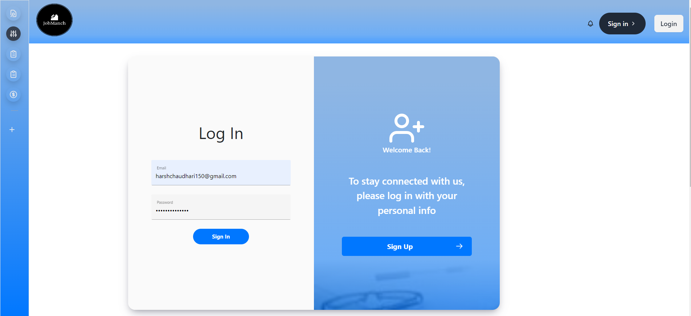
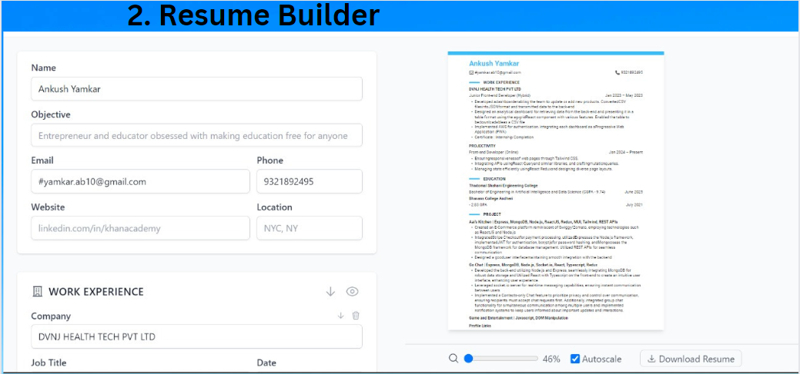

# Campus-Career-Hub

Welcome to the Campus-Career-Hub! This repository hosts a comprehensive platform designed to enhance the job search experience for university students. Below are detailed descriptions of the key features:

## 1. Interactive Calendar with Reminders in React
   - Keep track of upcoming interviews, deadlines, and events.
   - Set reminders for important dates to stay organized.

## 2. WhatsApp Notifications and Resource Bot
   - Receive notifications and access resources directly through WhatsApp for added convenience.

## 3. Comprehensive Job Information for On-Campus Companies
   - Access detailed information about companies recruiting on-campus, including job descriptions and requirements.

## 4. Alumni Network Integration using LinkedIn Connect and Socket.io for Chat Application
   - Connect with alumni through LinkedIn integration.
   - Utilize Socket.io for real-time chat functionality.

## 5. Curated Resources for Each Company using Previous Interaction Data
   - Access curated resources tailored to each company based on past interactions and feedback.

## 6. AI-based Mock Interviews using Next.js and Speech to Text, then Gemini for Interview Overview
   - Practice mock interviews with AI-powered feedback.
   - Utilize Next.js for the frontend and Gemini for interview analysis.

## 7. ATS Resume Match using Gemini and Flask API
   - Match resumes with job listings using AI technology.
   - Employ Flask API for seamless integration.

## 8. Resume Builder and Parser using Next.js and TypeScript
   - Create and parse resumes effortlessly.
   - Leverage TypeScript for type safety and Next.js for a robust frontend.

## 9. Student Performance Analytics using React.js
   - Analyze student performance metrics to track progress and identify areas for improvement.

## 10. Community Forums for General Doubts using React.js
   - Engage in discussions and seek assistance from peers through community forums.

